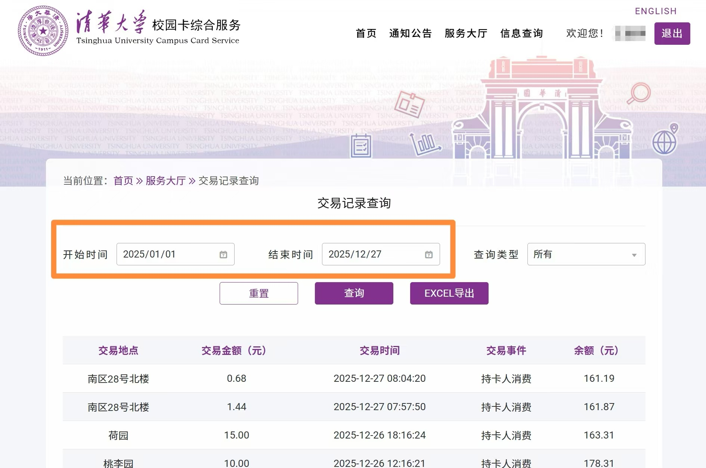
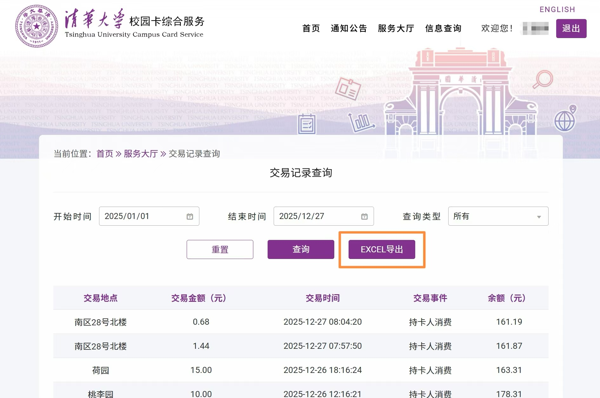
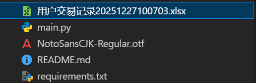
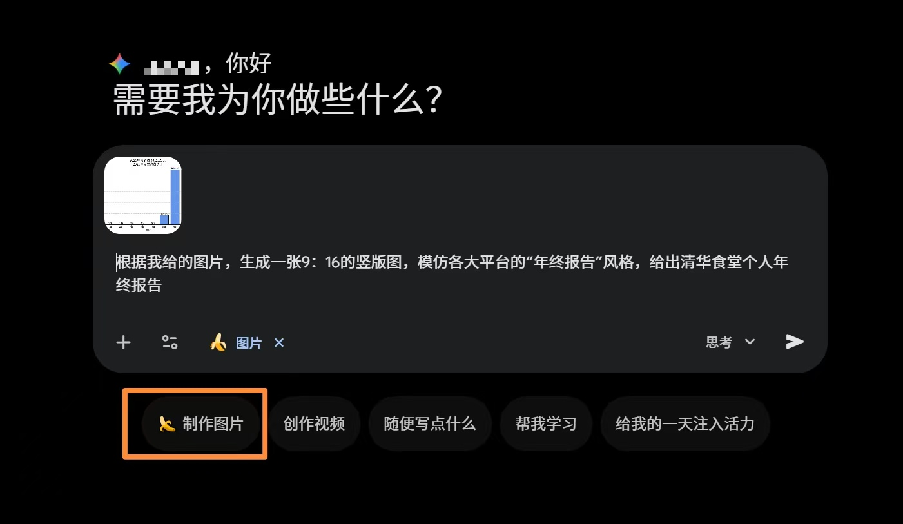
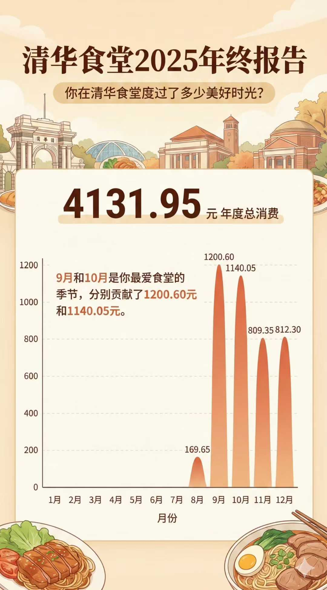

# THU-Canteen-Visualization-Annual-Report

​      2025年即将结束了，本人很好奇自己来清华的这半年吃了多少食堂，遂用codex和gemini搓出来了一版清华食堂年终报告，感兴趣的同学们可以复现一下，还蛮有意思的（原帖：[清华食堂年终报告（Codex + Gemini） - 小红书](https://www.xiaohongshu.com/explore/694ead4a000000001e0399cc?app_platform=android&ignoreEngage=true&app_version=9.13.0&share_from_user_hidden=true&xsec_source=app_share&type=normal&xsec_token=CBwmrS1oG9E-hG0xc48WjzdqjTuio2Q0ic5Jizyyxe04I=&author_share=1&shareRedId=ODo0MTg8PTw2NzUyOTgwNjc0OTk1OzlB&apptime=1766804453&share_id=bd0176fd336e41de858d21d42edbdcb2&share_channel=copy_link&appuid=642157930000000011021638&xhsshare=CopyLink)）。

## 项目简介

​      本项目用于统计THUer们2025年的食堂消费数据，项目通过Info的校园卡系统获取原始数据，将其进行可视化，并最终利用Nano Banana模型将可视化图表渲染为清华食堂年终报告。

> 本项目的灵感来源：
>
> > [leverimmy/THU-Annual-Eat: 一年过去了，你在华子食堂里花的钱都花在哪儿了？](https://github.com/leverimmy/THU-Annual-Eat)
> >
> > [华中科技大学/2021年校园卡消费账单](https://mp.weixin.qq.com/s/04A49nmDmOoLyKIYbFSBoA)
> >
> > [毕导/清华食堂10块钱能吃一天？一位老博士统计了他7年的饭卡记录](https://mp.weixin.qq.com/s/XQsoJ5mmNogJHDNFgSJHaw?scene=1)

## 复现方法

### 从Info的校园卡系统中获取原始数据

1. 登录[清华大学校园卡综合服务](https://card.tsinghua.edu.cn/)网站，点击**服务大厅**，点击**交易记录查询**。

2. 设置导出数据的起止时间（开始时间：2025/1/1；结束时间：今天）。

   

3. 导出自己的2025消费数据。

   

4. 将导出的文件放入**项目根目录**中，我们的原始数据就准备完毕了。

   

### 环境配置

* 创建环境

  ```
  conda create --name THU_Canteen python=3.10
  ```

* 激活环境

  ```
  conda activate THU_Canteen
  ```

* 安装所需的依赖

  ```
  pip install -r requirements.txt
  ```

### 生成可视化图表

* 运行脚本

  ```
  python main.py
  ```

* 代码运行结束后，即可在Outputs文件夹中获得可视化图表

  

### 将可视化图表渲染为清华食堂年终报告（以Outputs/2025年食堂消费统计.png为例）

* Outputs/2025年食堂消费统计.png如下图所示

  

* 登录Gemini官网[Google Gemini](https://gemini.google.com/app)

* 选择“制作图片”模式（使用Nano Banana模型），将2025年食堂消费统计.png上传

  

* Prompt如下：

  ```
  根据我给的图片，生成一张9：16的竖版图，模仿各大平台的“年终报告”风格，给出清华食堂个人年终报告
  ```

* 稍等片刻即可获得最终成品图

  
  
* 后续可以继续输入prompt对输出图片进行改进

## 致谢

> 本项目的灵感来源：
>
> > [leverimmy/THU-Annual-Eat: 一年过去了，你在华子食堂里花的钱都花在哪儿了？](https://github.com/leverimmy/THU-Annual-Eat)
> >
> > [华中科技大学/2021年校园卡消费账单](https://mp.weixin.qq.com/s/04A49nmDmOoLyKIYbFSBoA)
> >
> > [毕导/清华食堂10块钱能吃一天？一位老博士统计了他7年的饭卡记录](https://mp.weixin.qq.com/s/XQsoJ5mmNogJHDNFgSJHaw?scene=1)

## 联系方式

如果您对本项目有任何问题或建议，请通过wgq25@mails.tsinghua.edu.cn联系我。

